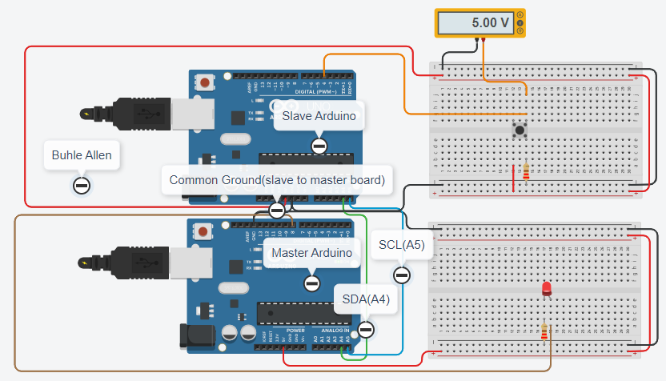
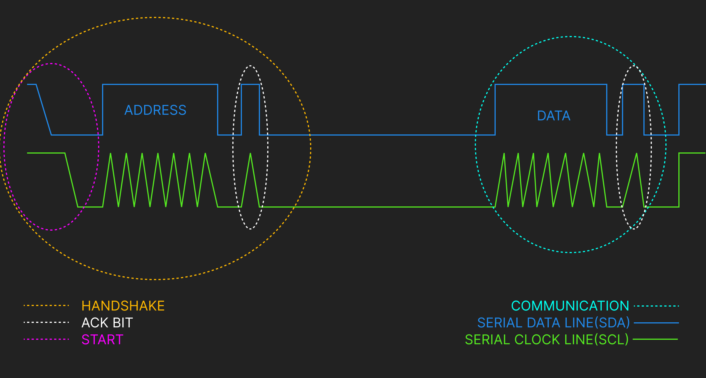

# I2C SERIAL COMMUNICATION PROTOCOL(ONE SLAVE AND ONE MASTER)

## Circuit Connection

This is basic I2C Serial Communication Protocol makes use of one slave and one master, the slave keeps track of the button the push button and send the button status to the master. The master will switch the LED light on when the button is pressed and switch off the LED when the button is not pressed.

## Oscilloscope lines Explanation

